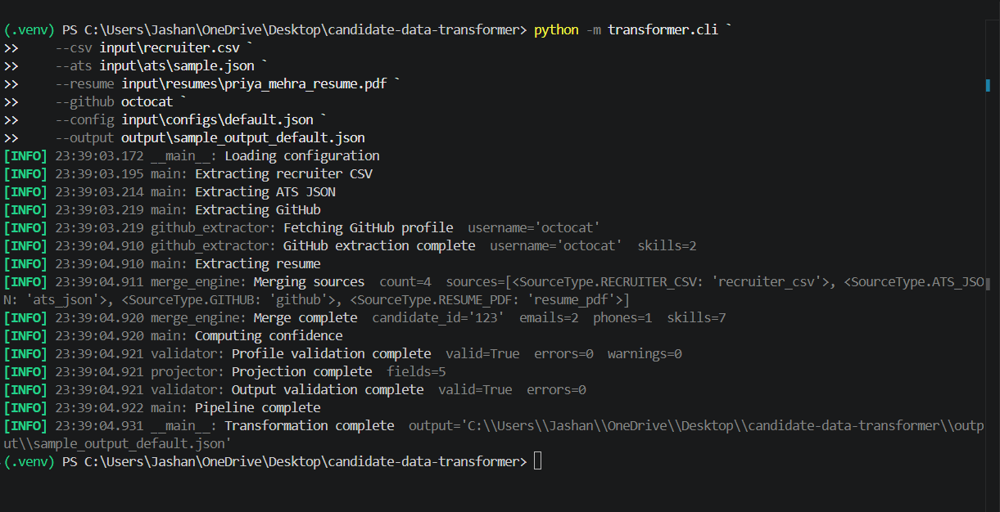
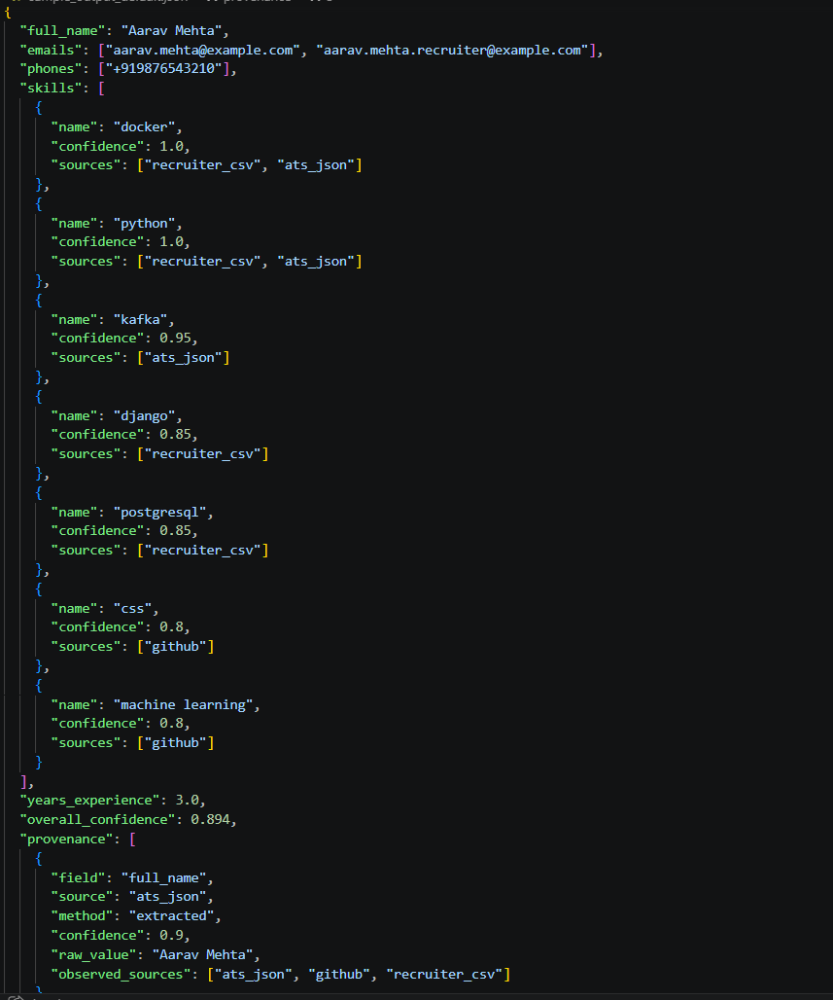
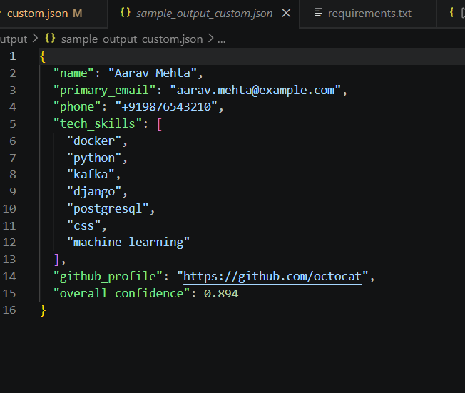
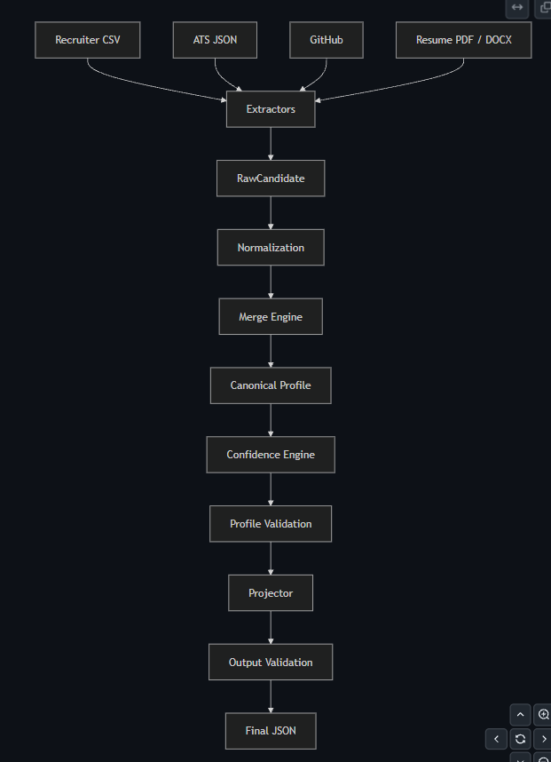
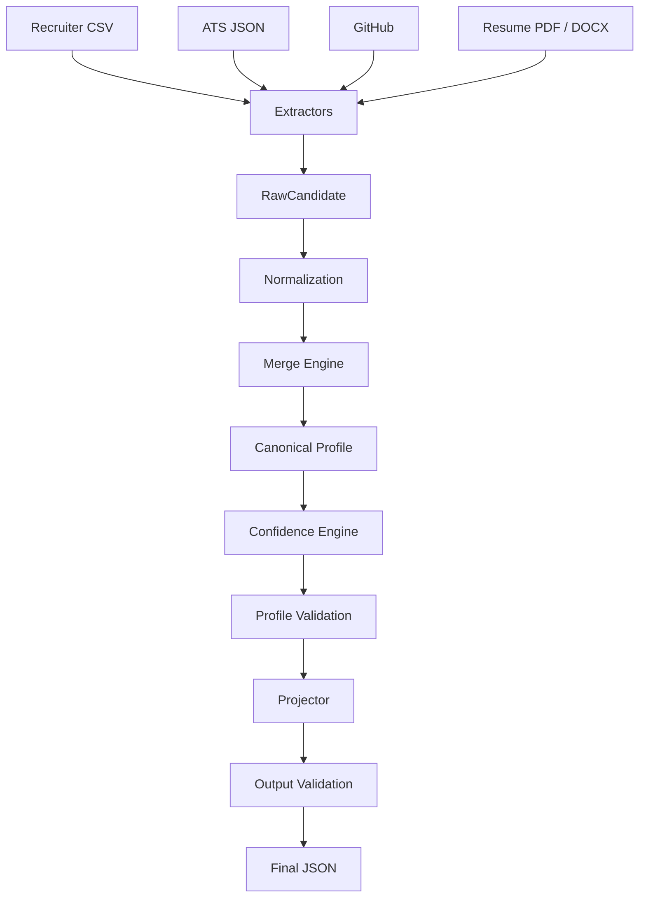
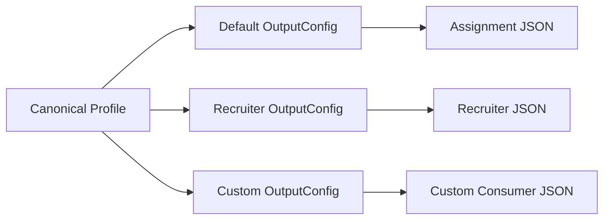

# Multi-Source Candidate Data Transformer

> **Eightfold Engineering Intern (Jul–Dec 2026) Assignment**

A production-inspired ETL pipeline that consolidates candidate information from multiple heterogeneous sources into a single canonical profile through normalization, deterministic conflict resolution, provenance tracking, confidence scoring, and configurable output projection.

The project is designed around the same principles commonly used in production data pipelines:

- Extract data from independent sources
- Normalize inconsistent representations
- Merge conflicting observations deterministically
- Preserve field-level provenance
- Estimate confidence for every resolved field
- Validate the canonical profile
- Project into configurable output schemas without changing business logic

> 📄 **Technical Design:** [`docs/design.md`](docs/design.md)  
> 🎥 **Demo Video:** *(Add YouTube / Google Drive link before submission.)*

---

## Repository Highlights

- ✅ Supports both **structured** and **unstructured** candidate sources
- ✅ Deterministic merge engine with field-specific conflict resolution
- ✅ Field-level provenance for complete traceability
- ✅ Confidence scoring for every resolved field
- ✅ Runtime configurable output (`OutputConfig`)
- ✅ Two-stage validation (canonical profile + projected output)
- ✅ Graceful degradation for malformed or unavailable sources
- ✅ **106 automated tests**
- ✅ Ruff formatted and linted

---

# Demo

### CLI Execution

The pipeline can be executed using the provided CLI by supplying any combination of supported input sources and a runtime output configuration.

> 📷 **Screenshot:** `assets/cli_demo.png`



---

### Default Output

The default configuration generates a schema-compliant canonical candidate profile matching the assignment specification.

> 📷 **Screenshot:** `assets/output_default.png`



---

### Custom Output

Using a different `OutputConfig`, the same canonical profile can be projected into a completely different JSON structure without changing any application code.

> 📷 **Screenshot:** `assets/output_custom.png`



---

### Pipeline Architecture

The pipeline follows a modular ETL architecture where each stage performs a single responsibility and communicates through well-defined domain models.

> 📷 **Diagram:** `assets/architecture.png`



---

# Quick Start

## Prerequisites

- Python **3.12+**
- Git
- Windows PowerShell (recommended) or Command Prompt

Clone the repository:

```powershell
git clone https://github.com/Jashan1001/candidate-data-transformer.git
cd candidate-data-transformer
```

Create and activate a virtual environment:

```powershell
python -m venv .venv
.venv\Scripts\activate
```

Install the project:

```powershell
pip install -r requirements.txt
pip install -e .
```

---

## Running the Pipeline

Execute the pipeline using the provided sample inputs and the default output configuration.

```powershell
python -m transformer.cli `
    --csv input\recruiter.csv `
    --ats input\ats\sample.json `
    --resume input\resumes\priya_mehra_resume.pdf `
    --github octocat `
    --config input\configs\default.json `
    --output output\sample_output_default.json
```

The generated output will be written to:

```text
output/sample_output_default.json
```

---

## Running with a Custom Configuration

The same canonical profile can be projected into a different output schema without modifying application code.

```powershell
python -m transformer.cli `
    --csv input\recruiter.csv `
    --ats input\ats\sample.json `
    --resume input\resumes\priya_mehra_resume.pdf `
    --github octocat `
    --config input\configs\custom_recruiter_view.json `
    --output output\sample_output_custom.json
```

---

## Running the Test Suite

Execute all automated tests:

```powershell
pytest
```

Expected output:

```text
106 passed
```

---

## Code Quality

Run Ruff to verify linting:

```powershell
ruff check .
```

Format the project:

```powershell
ruff format .
```

---

> **Linux/macOS:** Replace the activation command with:
>
> ```bash
> source .venv/bin/activate
> ```

# Project Overview

Modern hiring workflows collect candidate information from multiple independent systems. A single candidate may appear in recruiter spreadsheets, Applicant Tracking Systems (ATS), resumes, GitHub profiles, and other external sources. These sources are often incomplete, inconsistent, or contradictory.

The Candidate Data Transformer consolidates these heterogeneous inputs into a single **Canonical Profile** through a modular ETL pipeline.

The pipeline performs:

- Extraction from multiple independent sources
- Data normalization (emails, phones, names, skills, locations, dates)
- Deterministic conflict resolution
- Field-level provenance tracking
- Confidence estimation
- Canonical profile validation
- Configuration-driven output projection
- Final output validation

Rather than treating every source as a complete candidate record, the system reasons about **field-level observations**, allowing each field to be merged using the most appropriate strategy while preserving complete explainability.

---

# Supported Data Sources

The project satisfies the assignment requirement of processing both **structured** and **unstructured** candidate data.

| Source | Type | Status |
|---------|------|--------|
| Recruiter CSV | Structured | ✅ |
| ATS JSON (Greenhouse / Lever / Generic) | Structured | ✅ |
| GitHub Profile | Unstructured | ✅ |
| Resume (PDF / DOCX) | Unstructured | ✅ |

Each source is implemented as an independent extractor that converts its input into the common `RawCandidate` model.

This design keeps parsing logic isolated from business logic and allows new source types to be introduced without modifying the merge engine or downstream pipeline.

---

# Sample Fixtures

Since the assignment does not provide sample candidate data, this repository includes synthetic fixtures built specifically to exercise the transformation pipeline.

The committed fixtures intentionally contain realistic inconsistencies, including:

- Different phone number formats
- Conflicting years of experience
- Name variations across sources
- Skill aliases
- Different location representations
- Missing fields
- Malformed input examples

These fixtures demonstrate normalization, deterministic conflict resolution, provenance tracking, confidence scoring, and graceful degradation under realistic conditions.

> **Note:** All sample candidate information is fictional and used solely for demonstration and testing purposes.

# System Architecture

The Candidate Data Transformer follows a modular **Extract–Transform–Load (ETL)** architecture.

Each stage performs a single responsibility and communicates through explicit domain models, making the pipeline deterministic, testable, and easy to extend.



The pipeline separates parsing, normalization, conflict resolution, validation, and output generation into independent stages. Each component operates on a well-defined domain model instead of source-specific formats.

---

## Pipeline Stages

| Stage | Responsibility |
|--------|----------------|
| **Extractors** | Read external sources and convert them into `RawCandidate` objects. |
| **Normalization** | Standardize emails, phones, names, skills, dates, and locations. |
| **Merge Engine** | Resolve conflicting observations and construct a `CanonicalProfile`. |
| **Confidence Engine** | Estimate the reliability of each resolved field and the overall profile. |
| **Validation** | Verify both the canonical profile and projected output. |
| **Projector** | Transform the canonical profile into the runtime output schema defined by `OutputConfig`. |

---

## Why This Architecture?

The architecture was designed around four principles:

- **Single Responsibility** — every stage performs one well-defined task.
- **Deterministic Processing** — identical inputs always produce identical outputs.
- **Configuration over Code** — output schemas are controlled through configuration rather than application logic.
- **Extensibility** — new extractors, normalization rules, and output schemas can be introduced without modifying the existing pipeline.

A more detailed discussion of the architectural decisions and trade-offs is available in [`docs/design.md`](docs/design.md).

# Merge Strategy & Output Projection

Candidate information collected from multiple sources is rarely consistent. Different systems may report conflicting names, duplicate contact details, overlapping experience, or different representations of the same skill.

Instead of applying a single generic merge algorithm, the pipeline resolves each field using a strategy appropriate for its data type.

---

## Merge Strategy

Different categories of fields are merged differently.

| Field Type | Strategy |
|------------|----------|
| Full Name, Headline, Experience | Deterministic source-priority conflict resolution |
| Emails | Union + deduplication |
| Phone Numbers | Normalize → Union + deduplication |
| Skills | Canonicalize aliases → Union + deduplication |
| Experience & Education | Merge structured records where possible |

Merge decisions are deterministic. Given the same inputs and configuration, the pipeline always produces the same canonical profile.

---

## Field-Level Provenance

Every resolved field records how it was produced.

For each merged value the pipeline tracks:

- Winning source
- Contributing sources
- Original observations
- Extraction confidence
- Merge metadata

This makes every merge decision transparent and allows downstream consumers to understand exactly how the canonical profile was constructed.

---

## Confidence Scoring

Each canonical profile receives an overall confidence score derived from multiple signals, including:

- Source reliability
- Extraction confidence
- Cross-source agreement
- Normalization success
- Profile completeness

Confidence scores estimate the reliability of the merged profile without modifying the underlying candidate data.

---

## Configuration-Driven Output

The pipeline maintains a stable internal `CanonicalProfile`.

Different consumers often require different JSON schemas, so the final output is generated using a runtime `OutputConfig` rather than hard-coded mappings.

Supported configuration options include:

- Field selection
- Field renaming
- Nested output paths
- Runtime normalization
- Required field validation
- Missing field handling
- Optional provenance output
- Optional confidence output

This allows the same canonical profile to be projected into multiple consumer-specific schemas without changing business logic.

---

## Example


## Configuration-Driven Output




This separation between the internal domain model and the exported JSON keeps the merge engine independent of presentation requirements and makes the pipeline easy to extend for new consumers.

# Sample Output

The pipeline generates a canonical candidate profile that conforms to the runtime `OutputConfig`.

The example below shows a simplified version of the generated output.

```json
{
  "candidate_id": "candidate-001",
  "full_name": "Priya Mehra",
  "emails": [
    "priya.mehra@example.com"
  ],
  "phones": [
    "+919876543210"
  ],
  "location": {
    "city": "Bengaluru",
    "region": "Karnataka",
    "country": "IN"
  },
  "links": {
    "github": "https://github.com/octocat"
  },
  "headline": "Backend Software Engineer",
  "years_experience": 5,
  "skills": [
    {
      "name": "python",
      "confidence": 0.97
    },
    {
      "name": "fastapi",
      "confidence": 0.94
    },
    {
      "name": "docker",
      "confidence": 0.92
    }
  ],
  "overall_confidence": 0.94
}
```

The repository also includes complete generated outputs for both the default assignment schema and a custom projection under the `output/` directory.

# Robustness & Edge Cases

Real-world candidate data is often incomplete, inconsistent, or malformed. The pipeline is designed to recover from common failures whenever possible while producing the best canonical profile from the available information.

The implementation handles scenarios such as:

- Duplicate emails, phone numbers, and skills across multiple sources.
- Conflicting scalar values resolved using deterministic source priority.
- Different phone number formats normalized into E.164 representation.
- Skill aliases normalized into canonical names.
- Malformed ATS JSON without terminating the entire pipeline.
- Missing optional fields while preserving a valid canonical profile.
- GitHub API failures or rate limits through graceful degradation.
- Validation failures for required output fields during projection.

Failures are isolated to the affected source whenever possible, allowing the remaining sources to continue through the transformation pipeline.

# Testing

The project includes a comprehensive automated test suite covering extraction, normalization, merging, validation, projection, and confidence scoring.

Run the complete test suite:

```powershell
pytest
```

Run Ruff:

```powershell
ruff check .
```

Format the project:

```powershell
ruff format .
```

Current test status:

- ✅ 106 automated tests passing
- ✅ Ruff formatted and linted

# Tech Stack

| Category | Technology |
|----------|------------|
| Language | Python 3.12 |
| Data Models | Pydantic v2 |
| CLI | argparse |
| HTTP Client | requests |
| Resume Parsing | pdfplumber, python-docx |
| Phone Normalization | phonenumbers |
| Testing | pytest |
| Linting & Formatting | Ruff |

# Repository Structure

```text
candidate-data-transformer/
├── docs/
│   └── design.md
├── input/
│   ├── ats/
│   ├── configs/
│   ├── resumes/
│   └── recruiter.csv
├── output/
├── src/
│   └── transformer/
│       ├── confidence/
│       ├── extractors/
│       ├── merger/
│       ├── models/
│       ├── normalizers/
│       ├── projector/
│       ├── validator/
│       ├── cli.py
│       └── main.py
├── tests/
├── README.md
└── requirements.txt
```

# Design Document

The repository includes a detailed design document describing the architecture, merge strategy, configuration system, confidence model, trade-offs, and implementation decisions.

📄 **Location:** `docs/design.md`

# Known Limitations

- LinkedIn integration is intentionally excluded because there is no public, terms-compliant API.
- Automatic cross-candidate identity resolution is outside the scope of this assignment.
- OCR for scanned image-only resumes is not currently supported.

# Future Work

Potential future enhancements include:

- Additional ATS integrations
- Recruiter notes extractor
- Parallel source extraction
- Streaming candidate ingestion
- LLM-assisted resume parsing
- Improved semantic matching for experience and education

# License

This project is released under the MIT License.